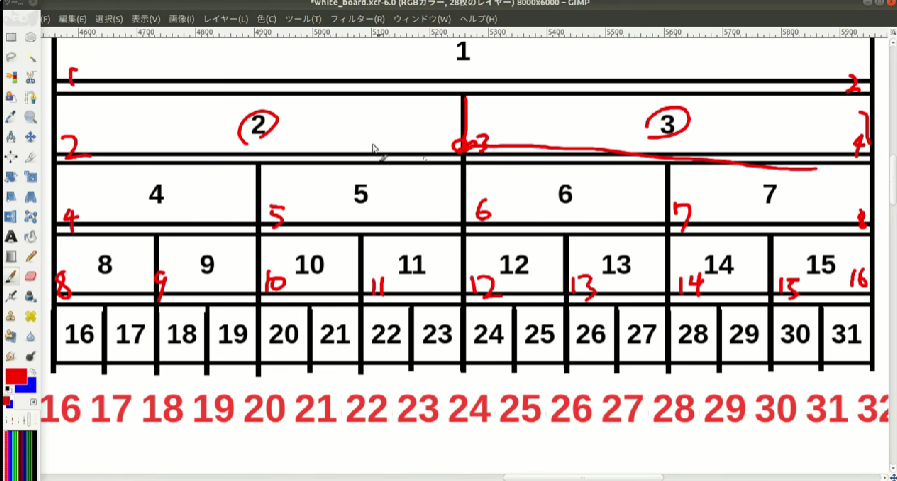
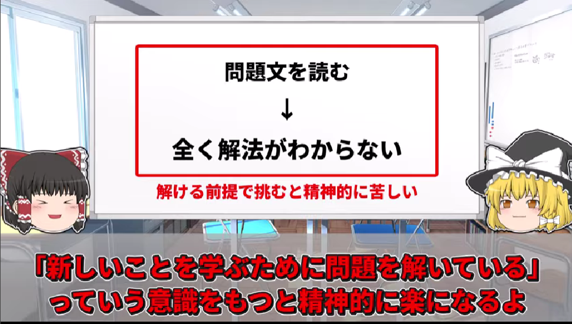

## 日付

2025-12-03

## やったこと

2:20:45

## 「伝えたい重要な情報」列に記載した情報数
※目標は最低3つ

記載数：3

初めてのセグ木はさらに6個分ある！

### APG4b

- [Range Sum Query (RSQ)](https://judge.u-aizu.ac.jp/onlinejudge/description.jsp?id=DSL_2_B&lang=jp)
<details>
<summary>
Range Sum Query (RSQ)
</summary>

```cpp

#include <bits/stdc++.h>
using namespace std;
#define rep(i, n) for (int i = 0; i < (int)(n); i++)

/**
問題の理解
00:02:00~
まず、セグメント木を用いるのは確定
セグメント木っていうのは、logNの構造

◆処理フロー
１．n,qを受け取る。
２．q回ループする。comで条件分岐する。0のとき,1のときそれぞれ,add(), getSum()を呼ぶ
◆add()
  考え方：根元から、一つ上に順繰り足していく
◆getSum()
  ・両端から攻める
  ・上に行けるならどんどん上に行く
  ・上に行けないときは、その要素の数を足して上に行く
// 00:18:00試しに実装してみる
*/
#define SEG_LEN (1 << 18) // 最初にここで定義しておくといい!!!余ったとしても別に使わないだけだから！それにセグ木はlogNだから2＾30でもたった30回の演算だけだから！！！
// #define SEG_LEN (3) // テスト用

void add(vector<int> &tree, int index, int num) { // 0:50:00
  // whileで足していく
  index += SEG_LEN;
  while(index > 0) {
    // tree.at(index) = num;  // これ [+=]じゃねぇか・・？？？
    tree.at(index) += num;
    // cout << "index: " << index << ' ';cout << tree.at(index) << ' ';
    index /= 2;
  }
  // rep(i, tree.size()) cout << tree.at(i) << ' ';cout << endl;
}

long long getSum(vector<int> &tree, int index_start, int index_end) {
  long long sum = 0;
  int left = index_start + SEG_LEN;
  int right = index_end + SEG_LEN;
  // cout << "index_start: " << index_start << endl;cout << "index_end: " << index_end << endl;cout << "left: " << left << endl;cout << "right: " << right << endl;

  // 両側から同時に攻める！なぜ同時に攻められるかというと、絶対に山の形になる（高さが同じ(割る回数が同じ)になる）からである！
  while(left < right) {
    // cout << "参考tree.at(left): " << tree.at(left) << endl;
    if(left % 2 == 1) {
      sum += tree.at(left);
      // cout << "tree.at(left): " << tree.at(left) << endl;
      left++;
    }
    left /= 2;
    if(right % 2 == 0) {
      sum += tree.at(right);
      // cout << "tree.at(right): " << tree.at(right) << endl;
      right--;
    }
    right /= 2;
  }
  if(left == right) {sum += tree.at(left);}
  return sum;
}

int main() {
  int n, q;
  cin >> n >> q;

  vector<int> tree(SEG_LEN*2);

  for (int i = 0; i < q; i++) {
    int com;
    cin >> com;
    int x, y;
    cin >> x >> y;
    if(com == 0) {
      add(tree, x-1, y);
    }else {
      long long sum = getSum(tree, x-1, y-1);
      cout << sum << endl;
    }
  }
  
  // 1:52:00
}

```
</details>

- [AA - 3.03.STLのコンテナ](https://atcoder.jp/contests/apg4b/tasks/APG4b_aa)

### Youtube
- [【木マスター養成講座】4-2. Segment木ってなに〜？なんかうまく区間取ってくる編【競プロかつっぱ】](https://www.youtube.com/watch?v=ReGvflPU81c&list=PL3Hpv03CoZ24p5a6qT0LsFKEhiDWxf_B_&index=4)
  - \

## 感想

はじめてのセグ木実装、なかなか骨が折れたけども、集計をlogNでできるのはさすがに熱いので、とりあえず実装できてよかった。うれしい。\
あと、そもそも上記のYoutube動画が良すぎるおかげ！

## KPI

スプレッドシートの、「伝えたい重要な情報」列に記載した情報数\
※新規のアルゴリズムは6個分としよう。骨が折れるから！

### 理由
これをKPIに設定することによって、問題を解くことや解く数がゴールではなくなる\
現時点で解けないということは、たくさん伝えたい情報を記載できるということを示すので、\
解けなかったことや難しい問題への挑戦そのものをとてもポジティブに評価できると考える

加えて、書けることを増やすために, 仮にAC出来た問題でも解説動画などをみて新たな知見を得ようという姿勢に自然となる


## ToDo
<!-- - さすがにformatterくらいは欲しくなってきた・・・\
　⇒VSCodeの拡張機能を入れてみた。様子見・・・ -->
- [GraphxGraph](https://hello-world-494ec.firebaseapp.com/)
- メディバンペイント
- C++の環境準備をしておく？
- わからんこと
  - [B - Guidebook](https://atcoder.jp/contests/abc128/tasks/abc128_b)「ちゃんとやるなら構造体作って、比較関数を用意してってやるのが理想的な実装」
  - [B - Guidebook](https://atcoder.jp/contests/abc128/tasks/abc128_b)「emplace_backを使うとちょっと早い」
  - [B - Guidebook](https://atcoder.jp/contests/abc128/tasks/abc128_b):[解説](https://blog.hamayanhamayan.com/entry/2019/06/03/201437)「ソート時に独自の比較関数を与えることが出来る」

<!-- ## AtCoder Problems
そういえば、現段階での情報を載せておいた方がいい気がしてきたので載せよう\
2022/11/05~2022/12/31までに6問だけやっていたらしい
  
 -->

## 金言
「茶色になるために一番重要なのは、C問題をひたすら解いて理解することだぜ、私はほとんどの問題を自力でACすることができず解説放送を見てようやっとACできた問題が7割ほどだったから、自分に才能がないと諦めないようにすることが大事だな。私は灰色の頃コンテストで負けるたびに何度も思っていたぜ」

- [【競技プログラミング】水色になってから一年で入青した方法【ゆっくり解説】](https://www.youtube.com/watch?v=rrpDnliQJdg)
  - 金言集
    - C,Fは急に壁が大きくなる\
    \
    -解こうとしても全くわからなくて答えを見て理解するしかない。という現象がA,C,F問題で毎回起きてひたすら受け身しかできなかった記憶がある\
    \
    - 最初の100問ぐらいは解いているというより解説をみてるという感じでボコボコにされるけれども、それでようやく問題に慣れてくるという感じだった。それで入青できているので実力はついてくる\
    グラフだけ見るとF問題の半分をちゃんと解いているようには見えるのだが実態は解くではなく何も分からないから解説を見て理解する作業が中心になっていた\
    

## やること
1. [APG4b](https://atcoder.jp/contests/APG4b)
  - 第２章まで（setやmapはB問題を解く中で身につく）
  - 練習問題も解く
2. [AtCoder に登録したら次にやること ～ これだけ解けば十分闘える！過去問精選 10 問 ～](https://qiita.com/drken/items/fd4e5e3630d0f5859067)
  - 動画主はどれも自力で解けずすべてけんちょんさんの解説を見たらしいので、解けなくても気落ちしない
  - C問題も載っているので理解するのは難しく解けなくて当たり前適当にやりましょう
  - 解説のコードで何が起きているかを一通り理解できるまで粘る
  - これでAtCoderで問題を解くときの一通りの流れがわかる
3. [A,B問題の精進](https://kenkoooo.com/atcoder/#/table/)
  - A問題を20問解いてからB問題に進む
  - vectorの使い方(1,2次元)
  - setやmapの使い方
  - 四近傍を配列荷物
  - グリッドやグラフの基礎（動画主も、グリッドとか何それ？と思っていたらしい）
  - 全探索の基礎
  - C問題以降でも毎回使うような基礎的な内容が学べる
  - 公式の解説放送がものすごくわかりやすいのでお勧めらしい
  - B問題をある程度解けるようになったらC問題に行くのがいいと思うらしい
  - 動画主は340~154までの約200問のB問題を解いたらしい・・・あくまで自分でやってみて満足すればCに進めばいいとのこと
  - ABC212以降から出題の仕方が変わっているため、それ以降の問題を解くのがお勧めらしい
4. [C問題の精進](https://kenkoooo.com/atcoder/#/table/)をひたすら解く
  - 灰色から茶色になろうとするとC問題を解く必要が出てくる
  - 茶色から緑色になろうとするタイミングではC問題のACは必須になる
  - C問題を100問くらい解き終わる頃には茶色になったらしい
5. [EDPC](https://atcoder.jp/contests/dp/tasks)
  - A~Eまで行ったらしい
  - ただ、EDPCの問題を解いたからと言って本番でDPの問題を解けたことはなかったらしい
  - 緑色になってから基礎的な内容を完璧に理解できたとのこと
  - ひとまず茶色になるまではDPを理解出来なくてもよさそうとのこと
