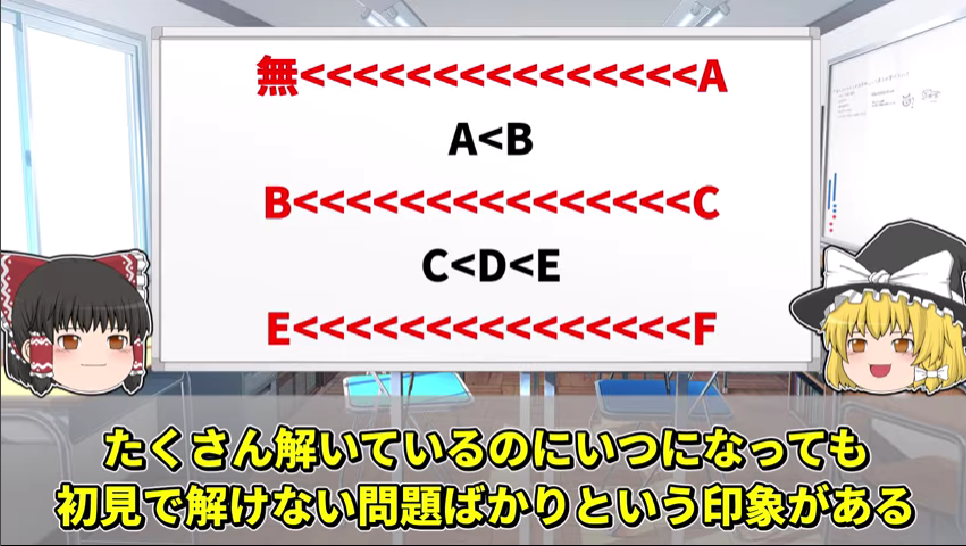
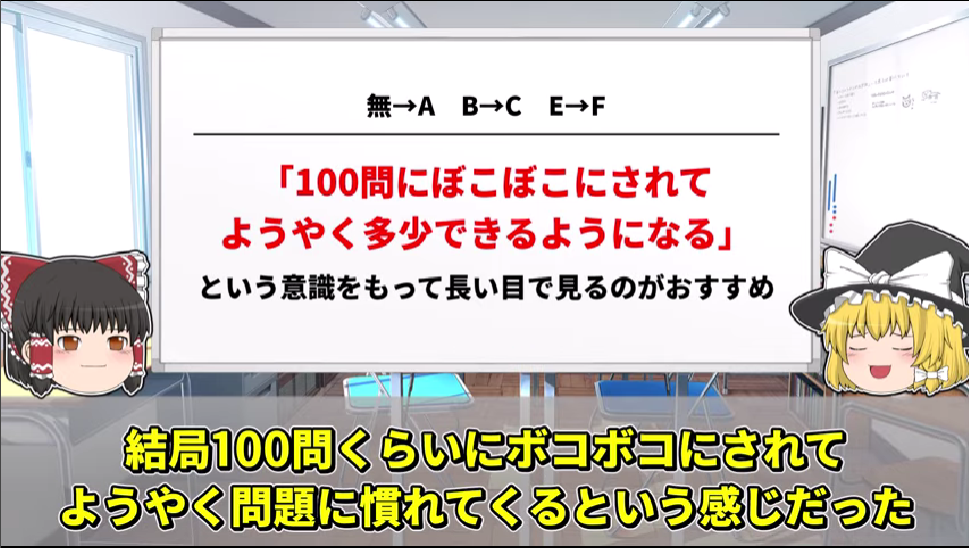

## 日付

2025-11-20

## やったこと

0:36:15

### APG4b

- [B - Find Permutation 2](https://atcoder.jp/contests/abc425/tasks/abc425_b)
  - できたぁ～
  - https://atcoder.jp/contests/abc425/submissions/71087040
- [A. What month is it?](https://atcoder.jp/contests/abc420/tasks/abc420_a)
  - https://atcoder.jp/contests/abc420/submissions/71087631

## 感想

ふぅ

## KPI

スプレッドシートの、「伝えたい重要な情報」列に記載した情報数

### 理由
これをKPIに設定することによって、問題を解くことや解く数がゴールではなくなる\
現時点で解けないということは、たくさん伝えたい情報を記載できるということを示すので、\
解けなかったことや難しい問題への挑戦そのものをとてもポジティブに評価できると考える

加えて、書けることを増やすために, 仮にAC出来た問題でも解説動画などをみて新たな知見を得ようという姿勢に自然となる

## ToDo
<!-- - さすがにformatterくらいは欲しくなってきた・・・\
　⇒VSCodeの拡張機能を入れてみた。様子見・・・ -->
- [GraphxGraph](https://hello-world-494ec.firebaseapp.com/)
- メディバンペイント
- C++の環境準備をしておく？

<!-- ## AtCoder Problems
そういえば、現段階での情報を載せておいた方がいい気がしてきたので載せよう\
2022/11/05~2022/12/31までに6問だけやっていたらしい
  
 -->

## 金言
「茶色になるために一番重要なのは、C問題をひたすら解いて理解することだぜ、私はほとんどの問題を自力でACすることができず解説放送を見てようやっとACできた問題が7割ほどだったから、自分に才能がないと諦めないようにすることが大事だな。私は灰色の頃コンテストで負けるたびに何度も思っていたぜ」

- [【競技プログラミング】水色になってから一年で入青した方法【ゆっくり解説】](https://www.youtube.com/watch?v=rrpDnliQJdg)
  - 金言集
    - C,Fは急に壁が大きくなる\
    \
    -解こうとしても全くわからなくて答えを見て理解するしかない。という現象がA,C,F問題で毎回起きてひたすら受け身しかできなかった記憶がある\
    \
    - 最初の100問ぐらいは解いているというより解説をみてるという感じでボコボコにされるけれども、それでようやく問題に慣れてくるという感じだった。それで入青できているので実力はついてくる\
    グラフだけ見るとF問題の半分をちゃんと解いているようには見えるのだが実態は解くではなく何も分からないから解説を見て理解する作業が中心になっていた\
    

## やること
1. [APG4b](https://atcoder.jp/contests/APG4b)
  - 第２章まで（setやmapはB問題を解く中で身につく）
  - 練習問題も解く
2. [AtCoder に登録したら次にやること ～ これだけ解けば十分闘える！過去問精選 10 問 ～](https://qiita.com/drken/items/fd4e5e3630d0f5859067)
  - 動画主はどれも自力で解けずすべてけんちょんさんの解説を見たらしいので、解けなくても気落ちしない
  - C問題も載っているので理解するのは難しく解けなくて当たり前適当にやりましょう
  - 解説のコードで何が起きているかを一通り理解できるまで粘る
  - これでAtCoderで問題を解くときの一通りの流れがわかる
3. [A,B問題の精進](https://kenkoooo.com/atcoder/#/table/)
  - A問題を20問解いてからB問題に進む
  - vectorの使い方(1,2次元)
  - setやmapの使い方
  - 四近傍を配列荷物
  - グリッドやグラフの基礎（動画主も、グリッドとか何それ？と思っていたらしい）
  - 全探索の基礎
  - C問題以降でも毎回使うような基礎的な内容が学べる
  - 公式の解説放送がものすごくわかりやすいのでお勧めらしい
  - B問題をある程度解けるようになったらC問題に行くのがいいと思うらしい
  - 動画主は340~154までの約200問のB問題を解いたらしい・・・あくまで自分でやってみて満足すればCに進めばいいとのこと
  - ABC212以降から出題の仕方が変わっているため、それ以降の問題を解くのがお勧めらしい
4. [C問題の精進](https://kenkoooo.com/atcoder/#/table/)をひたすら解く
  - 灰色から茶色になろうとするとC問題を解く必要が出てくる
  - 茶色から緑色になろうとするタイミングではC問題のACは必須になる
  - C問題を100問くらい解き終わる頃には茶色になったらしい
5. [EDPC](https://atcoder.jp/contests/dp/tasks)
  - A~Eまで行ったらしい
  - ただ、EDPCの問題を解いたからと言って本番でDPの問題を解けたことはなかったらしい
  - 緑色になってから基礎的な内容を完璧に理解できたとのこと
  - ひとまず茶色になるまではDPを理解出来なくてもよさそうとのこと
